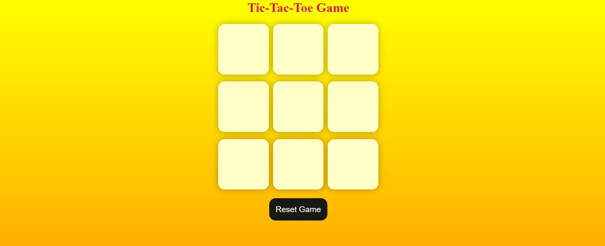

# 🎮 Tic-Tac-Toe Game  


A simple and interactive **Tic-Tac-Toe** game built using **HTML, CSS, and JavaScript**.  
Play against a friend, track the winner, and reset or start a new game anytime!  

---

## 🚀 Features  
- Two-player gameplay (X vs O).  
- Automatic winner detection.  
- Reset and New Game functionality.  
- Responsive and simple UI.  
- Highlighted winner message.  

---

## 🛠️ Tech Stack  
- **HTML5** – Structure  
- **CSS3** – Styling and layout  
- **JavaScript (Vanilla JS)** – Game logic  

---

## 📂 Project Structure  

---

## 🎯 How to Play  
1. Open `index.html` in your browser.  
2. Player **O** starts first.  
3. Players take turns clicking on the boxes.  
4. The game declares a winner when 3 marks align (row, column, or diagonal).  
5. Use **Reset** or **New Game** buttons to restart.  

---

## 📸 Screenshot  

  

---

## 📥 Installation / Run Locally  
1. Clone this repository:  
   ```bash
   git clone https://github.com/your-username/tic-tac-toe.git
2. Open The project folder.
3. run index.html in your Browser.


https://Ganapakakomal2003.github.io/tic-tac-toe/

## 🙌 Author

👨‍💻 Ganapaka Komal Babu.
🎓 Student at Sreenidhi Institute of Science and Technology.
💡 Goal: To become a Software Engineer.
   
